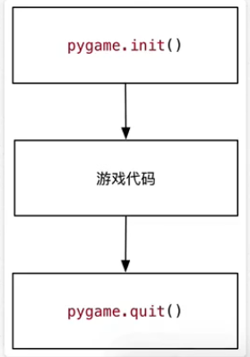
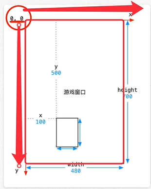
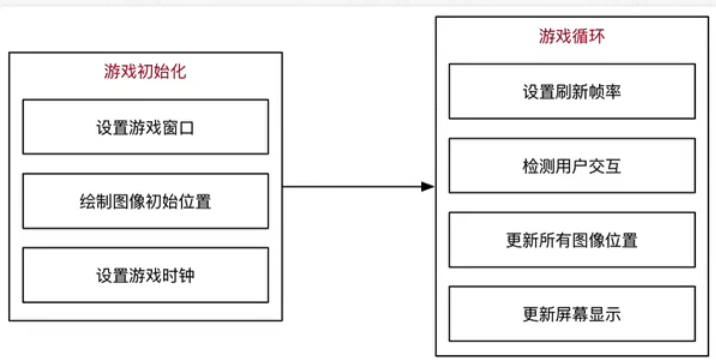
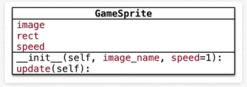
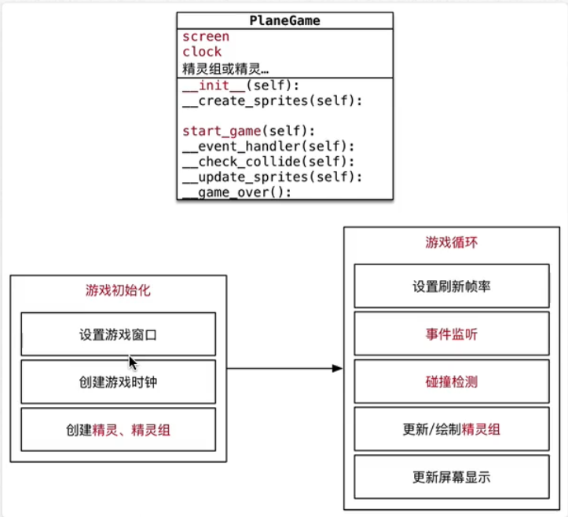
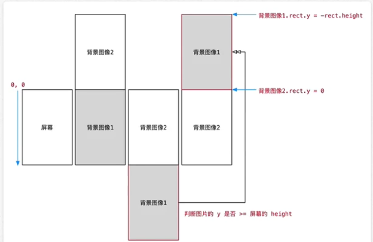

# 项目实战 -- 飞机大战
- 强化 **面向对象**设计
- 体验使用 `pygame`模块进行 **游戏开发**

## 实战步骤
1. `pygame`快速体验
2. **飞机大战**实战

## 确认模块 -- pygame
- `pygame` 就是一个python模块，专为电子游戏设计
- 官方网站: [https://www.pygame.org](https://www.pygame.org)
    - **提示**: 要学习第三方模块，通常最好的参考资料就在官方网站
    
|网站栏目|内容|
|---|---|
|GettingStarted|在各平台安装模块的说明|
|Docs|pygame模块所有**类**和**子类**的参考手册|
## 安装pygame
`pip install pygame`
## 验证安装
`python -m pygame.example.aliens`

# pygame 快速入门

## 目标
1. 项目准备
2. 使用 `pygame`创建图形窗口
3. 理解**图像**并实现图像绘制
4. 理解**游戏循环**和**游戏时钟**
5. 理解**精灵**和**精灵组**

## 项目准备
1. 新建**飞机大战**项目
2. 新建一个 `hm_pygame入门.py`
3. 导入**游戏素材图片

##### 游戏的第一印象
- 把一些 **静止的图象** 绘制到 **游戏窗口** 中
- 根据 **用户的交互** 或其他情况，**移动** 这些图像，产生动画效果
- 根据 **图像之间** 是否发生重叠，判断 **敌机是否被摧毁** 等其他情况

## 01.使用pygame创建图形窗口
### 小节目标
1. 游戏的初始化和退出
2. 理解游戏中的坐标系
3. 创建游戏主窗口
4. 简单的游戏循环
> 可以将图片素材**绘制**到**游戏的窗口**上，开发游戏之前需要先知道 **如何建立游戏窗口!**
### 1.1游戏的初始化和退出
- 要使用 `pygame`提供的所有功能之前，需要调用 `init`方法
- 在游戏结束前需要调用一下`quit`方法

方法|说明
---|---
pygame.init()|导入并初始化所有pygame模块，使用其他模块之前，必须先调用init方法
pygame.quit()|写在所有pygame模块，在游戏结束之前调用！

###1.2理解游戏中的坐标系
- 坐标系
    - **原点**在**左上角**`(0,0)`
    - **x轴** 水平方向向**右**，逐渐增加
    - **y轴**垂直方向向**下**，逐渐增加
    

- 在游戏中，**所有可见的元素** 都是以 **矩形区域** 来描述位置的
    - 要描述一个矩形区域有四个要素: `(x,y) (width,height)`
-  `pygame` 专门提供一个类`pygame.Rect`用于描述 **矩形区域**
`Rect(x,y,width,height) -> Rect`

`Rect.size返回值是元组(width,height)`
#### 提示
- `pygame.Rect`是一个比较特殊的类，内部只是封装了一些数字计算
- 不执行 `pygame.init()`方法同样能够直接使用
#### 案例演练
#### 需求
1. 定义 `hero_rect()`矩形描述 **英雄的位置和大小**
2. 输出英雄的 **坐标原点(`x`和`y`)**
3. 输出英雄的 **尺寸(宽度和高度)**

### 1.3创建游戏主窗口
- `pygame`专门提供了一个**模块** `pygame.display`用于创建、管理**游戏窗口**

方法|说明
---|---
pygame.display.set_mode()|初始化游戏显示窗口
pygame.display.update()|刷新屏幕内容显示，稍后使用
`set_mode()`方法

    	set_mode(resolution=(0,0),flags=0,depth=0) -> Surface

- 作用 -- 创建游戏显示窗口
- 参数
    - `resolution`指定屏幕的`宽`和`高`，默认创建的窗口大小和屏幕大小一致
    -  `flags`参数指定屏幕的附加选项，例如是否全屏等等，默认不需要传递
    - `depth`参数表示颜色的位数，默认自动怕匹配、
- 返回值
    - 暂时 可以理解为 **游戏的屏幕，游戏的元素** 都需要被绘制到 **游戏的屏幕** 上
- 注意: 必须使用变量记录 `set_mode()`方法的返回结果！因为：后续所有的图像绘制都基于这个返回结果

	    #创建游戏主窗口
	    screen = pygame.display.set_mode((480,700))

### 1.4简单的游戏循环
- 为了做到游戏程序启动后，**不会立刻推出**，通常在游戏程序中增加一个**游戏循环**
- 所谓 **游戏循环** 就是一个 **无限循环**
- 在 **创建游戏窗口** 代码下方，增加一个无限循环
    - 注意: **游戏窗口不需要重复创建**

	    	# 创建游戏主窗口
		    screen = pygame.display.set_mode((480,700))
		    # 游戏循环
		    while True:
		        pass

## 02.理解 图像并实现图像绘制
- 在游戏中，能够看到的 **游戏元素** 大多都是 **图像**
    - **图像文件**初始是保存在磁盘上的，如果需要使用，第一步 就需要 被加载到内存中
- 要在屏幕上 **看到某一个图像的内容**，需要按照三个步骤：
    1. 使用`pygame.image.load()`加载图像的数据
    2. 使用 **游戏屏幕** 对象，调用 `blit()`方法将图像绘制到指定位置
    3. 调用 `pygame.display.update()`方法更新整个屏幕的显示
    

> 提示: 要想在屏幕上看到绘制的结果，就一定要调用 `pygame.display.update()`方法
#### 代码演练I -- 绘制背景图像
##### 需求
   1. 加载 `background.png` 创建背景
   2. 将 **背景** 绘制在屏幕的 `(0,0)` 位置
   3. 调用屏幕更新显示背景图像
   
#### 代码演练II -- 绘制英雄图像
##### 需求
 1. 加载 `me1.png` 创建英雄飞机
 2. 将**英雄飞机**绘制在屏幕的 `(200,500)`位置
 3. 调用屏幕更新显示飞机图像

	    # 1. 加载图像数据
	    bg = pygame.image.load("./素材/images/me1.png")
	    # 2. blit绘制图像
	    screen.blit(bg,(0,0))
	    # 3. update 更新屏幕显示
	    pygame.display.update()

##### 透明图像
- `png`格式的图像是支持透明的
- 在绘制图像时，**透明区域**不会显示任何内容
- 但是如果**下方已有内容**，会 **透过 透明区域** 显示出来

### 理解 update()方法的作用
>可以在`screen`对象完成 **所有** `blit`方法之后，统一调用一次 `display.update()`方法，
同样可以在屏幕上看到最终的绘制结果
- 使用 `display.set_mode()`创建的 `screen`对象是一个内存中的屏幕数据对象
    - 可以理解成时 油画的画布
- `screen.blit`方法可以在画布上绘制很多图像
    - 例如：英雄、敌机、子弹
    - 这些图像 有可能 会彼此重叠或者覆盖
- `display.update()`会将画布的最终结果绘制在屏幕上，这样可以 提高屏幕绘制效率，增加游戏的流畅度
#### 案例调整

	    import pygame
	    from time import  clock
	    pygame.init()
	    
	    # 创建游戏窗口
	    screen = pygame.display.set_mode(size=(480,700))
	    
	    # 绘制背景图像
	    bg = pygame.image.load("./素材/images/bg.png")
	    screen.blit(bg,(0,0))
	    
	    # 绘制英雄的飞机
	    me1 = pygame.image.load("./素材/images/me1.png")
	    screen.blit(me1,(200,500))
	    
	    # 可以在所有绘制工作完成之后，统一调用update方法
	    pygame.display.update()
	    
	    # 游戏循环
	    while True:
	        #clock.tick(60)  # 通过tick方法每秒刷新60帧
	    
	        for event in pygame.event.get():
	            if event.type == pygame.QUIT:
	                pygame.quit()
	                print("退出游戏……")

## 03.理解游戏循环和游戏时钟
>现在英雄飞机已经被绘制到屏幕上了，怎么能够让飞机移动呢？
### 3.1游戏中的动画实现原理
- 跟 **电影**的原理类似，游戏中的动画效果，本质上时快速的在屏幕上绘制图像
    -电影是将多张**静止的电影胶片连续、快速的**播放，产生连贯的视觉效果
- 一般在电脑上每秒绘制60次，就能够达到非常连续高品质的动画效果
    - 每次绘制的结果被称为 **帧Frame**
### 3.2游戏循环
#### 游戏的两个组成部分
>游戏循环的开始 就意味着 游戏的正式开始

#### 游戏循环的作用
1. 保证游戏不会直接退出
2. 变化图像位置 -- 动画效果
    - 每隔`1/60秒`移动一下所有图像的位置
    - 调用 `pygame.display.update()`更新屏幕显示
3. 检测用户交互 -- 按键、鼠标等

### 3.3 游戏时钟
- `pygame`专门提供一个类 `pygame.time.Clock`可以非常方便的设置屏幕绘制速度 -- 刷新帧率
- 要使用 时钟对象 需要两步：
    - 在游戏初始化创建一个时钟对象
    - 在游戏循环中让时钟对象调用 `tick(帧率)`方法
- `tick`方法会根据上次被调用的时间，自动设置游戏循环中的延时
### 3.4英雄的简单动画实现
#### 需求
1. 在游戏初始化定义一个 `pygame.Rect`的变量记录英雄的初始位置
2. 在游戏循环中每次让英雄的 `y-1`--向上移动
3. `y<=0`将英雄移动到屏幕底部
>提示:
>- 每一次调用 `update()`方法之前，需要把所有的游戏图像都重新绘制一遍
>- 而且应该最先重新绘制背景图像

    # 1. 定义Rect记录飞机的初始位置
    hero_rect = pygame.Rect(200,500,102,126)
    
    # 游戏循环 -> 意味着游戏的正式开始
    while True:
        # 指定循环体内不代码执行的帧率
        clock.tick(60)  # 通过tick方法每秒刷新60帧
    
        # 2. 修改飞机位置
        if hero_rect.y>-hero_rect.height:
            hero_rect.y -= 1
        else:
            hero_rect.y = 700
    
        # 3. 调用blit方法绘制图像
        # 如果只绘制飞机图像，会出现飞机残影
        # 解决办法：先重新绘制背景图像直接遮挡先前图像，再绘制飞机
        screen.blit(bg, (0, 0))#重新绘制背景图像
        screen.blit(me1,hero_rect)
    
        # 4. 调用update方法更新显示
        pygame.display.update()
    
        for event in pygame.event.get():
            if event.type == pygame.QUIT:
                pygame.quit()
                print("退出游戏……")

#### 作业
1. 英雄向上飞行，当英雄完全从上方飞出屏幕后
2. 将飞机移动到屏幕底部

    	#2. 修改飞机位置
        if hero_rect.y>- hero_rect.height:
            hero_rect.y -= 1
        else:
            hero_rect.y = 700

### 3.5 在游戏循环中 监听 事件
#### 事件 event
- 就是游戏启动后，用户针对游戏所做的操作
- 例如：点击关闭按钮，点击鼠标，按下键盘。。。
#### 监听
- 再游戏循环中，判断用户 具体的操作
>只有捕获到用户具体的操作，才能有针对性的做出响应
#### 代码实现
- `pygame`中通过 `pygame.event.get()可以获得用户当前所做动作的事件列表
    - 用户可以同一时间做很多事情
- 提示: 这段代码非常的固定，几乎所有的 `pygame`游戏都大同小异

		clock = pygame.time.Clock()
		#游戏循环
		while True:
		    # 设置屏幕刷新帧率
		    clock.tick(60)
		    #事件监听
		    # pygame.event.get() 返回值 list
		    
		    for event in pygame.event.get():
		        if event.type == pygame.QUIT:
		            print("退出游戏……")
		            pygame.quit()
		            # 直接退出系统
		            exit()

## 04 理解精灵和精灵组
### 4.1 精灵和精灵组
- 再刚刚完成的案例中，图像加载、位置变化、绘制图像都需要程序员编写代码分别处理
- 为了简化开发步骤，`pygame`提供了两个类
    - `pygame.sprite.Sprite`--存储图像数据 image和 位置rect的对象
    - `pygame.sprite,Group`
    

### 4.2 派生精灵子类
1. 新建 `plane_sprites.py`文件
2. 定义 `GameSprite` 继承自 `pygame.sprite.Sprite
#### 注意
- 如果一个类的 父类 不是 `object`
- 在重写初始化方法时，一定要 先 `super()`一下父类的 `__init__`方法
- 保证父类中实现的 `__init__`代码能够被正常执行

#### 属性
- `image`精灵图像，使用 `image_name`加载
- `rect`精灵大小，默认使用图像大小
- `speed`精灵移动速度，默认为 `1`

#### 方法
- `update`每次更新屏幕时在游戏循环内调用
    - 让精灵的 `self.rect.y+=self.speed`
#### 提示
- `Image`的 `get_rect()`方法，可以返回pygame.Rect(0,0,图像宽,图像高)的对象

		import pygame
		
		class GameSprite(pygame.sprite.Sprite):
		    """飞机大战游戏精灵"""
		    def __init__(self,image_name,speed=1):
		
		        # 调用父类的初始化方法
		        super().__init__()
		
		        # 定义对象的属性
		        self.image = pygame.image.load(image_name)
		        self.rect = self.image.get_rect()
		        self.speed = speed
		
		    def update(self):
		
		        # 在屏幕的垂直方向上移动
		        self.rect.y +=self.speed

### 4.3 使用 游戏精灵和精灵组创建敌机
#### 需求 
- 使用刚刚派生的**游戏精灵**和**精灵组** 创建敌机并且实现敌机动画
#### 步骤
1. 使用 `from` 导入 `plane_sprite`模块
    - `from`导入的模块可以直接使用
    - `import`导入的模块需要通过模块名来使用
2. 在游戏初始化创建精灵对象和精灵组对象
3. 在游戏循环中让精灵组分别调用 `update()`和 `draw(screen)`方法
#### 职责
- 精灵
    - 封装 **图像image**、**位置rect**和**速度speed**
    - 提供 `update()`方法，根据游戏需求，**更新位置rect**
- 精灵组
    - 包含多个精灵对象
    - `update`方法，让精灵组中的所有精灵调用`update`方法更新位置
    - `draw()`方法，在`screen`上绘制精灵组中的所有精灵
    
# 游戏框架搭建
目标 -- 使用**面向对象**设计**飞机大战游戏类**
## 目标
- 明确主程序职责
- 实现主程序类
- 准备游戏精灵组

## 01.明确主程序职责
- 回顾 **快速入门案例**，一个游戏主程序的**职责**可以分为两个部分：
    - 游戏初始化
    - 游戏循环
- 根据明确的职责，设计 `PlaneGame`类如下：

>**提示** 根据 **职责**封装私有方法，可以避免某一个方法的代码写得太过冗长
>如果某一个方法编写的太长，既不好阅读，也不好维护
- **游戏初始化 -- `__init__()`会调用一下方法:

方法|职责
----|----
__event_handler(self)|事件监听
__check_collide(self)|碰撞检测 -- 子弹销毁敌机、敌机撞毁英雄
__update_sprites(self)|精灵组更新和绘制
__game_over()|游戏结束

## 02.实现飞机大战主游戏类

### 2.1 明确文件职责

- `plane_main`
    1. 封装 **主游戏类**
    2. 创建**游戏对象**
    3. 启动游戏
- `plane_sprites`
    - 封装游戏中所有需要使用的精灵子类
    - 提供游戏的相关工具
#### 代码实现
- 新建 `plane_main.py`文件，并且设置为可执行
- 编写 **基础代码**

		import pygame
		
		class PlaneGame(object):
		    """飞机大战主游戏"""
		
		    def __init__(self):
		        print("游戏初始化")
		
		        # 1. 创建游戏的窗口
		        self.screen = pygame.display.set_mode((480,700))
		        # 2. 创建游戏的时钟
		        self.clock = pygame.time.Clock()
		        # 3. 调用私有方法，精灵和精灵组的创建
		        self.__create_sprites()
		        
		    def __create_sprites(self):
		        pass

#### 使用 常量 代替固定数值
>- 常量 -- 不变化的量
>- 变量 -- 可以变化的量

#### 应用场景
- 在开发时，可能会需要使用 固定式的数值，例如 屏幕的高度 时 `700`
- 这个时候，建议 **不要**直接使用固定数值，而应该使用 **常量**
- 在开发时，为了保证代码的可维护性，尽量不要使用 **魔法数字**

#### 常量的定义
- 定义 **常量**和定义 **变量**的语法完全一样，都是使用 **赋值语句**
- **常量**的 **命名** 应该 **所有字母都是用大写，单词与单词之间使用下划线连接**
#### 常量的好处
- 阅读代码时，通过 **常量名 见名知意**，不需要猜测数字的含义
- 如果需要 **调整值** ，只需要 **修改常量定义** 就可以实现 **统一修改**
>提示： Python中并没有真正意义的常量，只是通过命名的约定 -- 所有字母大写的就是常量，开发时不要轻易的修改！
#### 代码调整
- 在 `plane_sprites.py`中增加常量定义

# 游戏背景

## 目标
- 背景交替滚动的思路确定
- 显示游戏背景

## 01.背景交替滚动的思路确定
运行 备课代码，观察背景图像的显示效果
- 游戏启动后，**背景图像**会**连续不断地向下方**移动
- 在视觉上 产生英雄地飞机不断向上方飞行地 **错觉** -- 在很多跑酷类游戏中常用地套路
    - 游戏地背景 不断变化
    - 游戏地主角 位置保持不变
### 1.1 实现思路分析

### 解决办法
1. 创建两张背景图像精灵
    - 第`1`涨完全和屏幕重合
    - 第`2`涨在屏幕地正上方
2. 两张图像 一起向下方运动
    - `self.rect.y += self.speed
3. 当 任意背景精灵地 `rect.y >= 屏幕的高度`说明已经移动到屏幕下方
4. 将 移动到屏幕下方地这张图像设置到 屏幕的正上方
    - `rect.y = -rect.height `
    
### 1.2 设计背景类

- 初始化方法
    - 直接指定背景图片
    - `is_alt`判断是否是另一张图像
        - `False`表示 第一张图像，需要与屏幕重合
        - `True`表示 另一张图像，在屏幕的正上方
- update()方法
    - 判断 **是否移动出屏幕**，如果是，将图像设置到屏幕的正上方，从而实现 **交替滚动**
>**继承**如果父类提供的方法，不能满足子类的需求
>- 派生一个子类
>- 在子类中针对特有的需求，重写父类方法，并且进行扩展 

## 02.显示游戏背景
### 2.1 背景精灵的基本实现
- 在`plane_sprites`新建`Background`继承自`GameSprtie`

		class Background(GameSprite):
		    """游戏背景精灵"""
		
		    def update(self):
		
		        # 1. 调用父类的方法实现
		        super().update()
		        # 2. 判断是否移出屏幕,如果移出屏幕，将图像设置到屏幕的上方,
		        if self.rect.y >= SCREEN_RECT.height
		            self.rect.y = -self.rect.height

### 2.2 在plane_main.py中显示背景精灵
1. 在 `__create_sprites`方法中创建精灵和精灵组
2. 在 `__update_sprites`方法中，让精灵组调用 `update()`和`draw()`方法
> `__create_sprites`方法

	    def __create_sprites(self):
	
	        # 创建背景精灵和精灵组
	        bg1 = Background('./素材/images/bg.png')
	        bg2 = Background('./素材/images/bg.png')
	        bg2.rect.y = -bg2.rect.height # 初始化第二章背景精灵位置
	        self.back_group = pygame.sprite.Group(bg1,bg2)
	        
	    def __update_sprites(self):
	        
	        self.back_group.update()
	        self.back_group.draw(self.screen)

### 2.3 利用初始化方法，简化背景精灵创建
>思考 -- 上一小节完成的代码存在什么样的问题？能否简化？
- 在主程序中，创建的两个北京经理，传入了相同的图像文件路径
- 创建 第二个背景精灵时，在主程序中，设置背景精灵的图像位置
>思考 -- 精灵初始位置的设置，应该由主程序负责？还是由精灵自己负责？

答案 -- 由精灵自己负责
- 根据面向对象设计原则，应该将对象的职责，封装到类的代码内部
- 尽量简化程序调用一方的代码调用

- 初始化方法
    - 直接指定背景图片
    - `is_alt`判断是否是另一张图像
        - `False`Biaoshi第一张图像，需要与屏幕怒重合
        - `True`表示另一张图像，在屏幕的正上方
在 `plane_sprites.py`中实现 `Background`的初始化方法

# 敌机出场
## 目标
- 使用 **定时器**添加敌机
- 设计`Enemy`类
## 01.使用定时器添加敌机
运行**备课代码**，观察敌机的**出现规律**
1. 游戏启动后，**每隔一秒**会**出现一架敌机**
2. 每架飞机**向屏幕下方飞行**，飞行**速度各不相同**
3. 每架敌机出现的 **水平位置**也不尽相同
4. 当敌机**从屏幕下方飞出**，不会再飞回到屏幕中

### 1.1 定时器
- 再 `pygame`中可以使用 `pygame.set_timer()`来添加 **定时器**
- 所谓 **定时器**， 就是 **每隔一段时间**，去**执行一些动作**

	`set_timer(eventid,milliseconds) -> None`

- `set_timer`可以创建一个**事件**
- 可以在 **游戏循环**的**事件监听**方法中捕获该事件
- 第一个参数 **事件代号**需要基于常量`pygame.USEREVENT`来指定
    - `USEREVENT`是一个整数，再添加的事件可以使用 `USEREVENT + 1`指定，依此类推...
- 第二个参数是 **事件触发**间隔的 **毫秒值**
#### 定时器事件的监听
- 通过 `pygame.event.get()`可以获取当前时刻所有的事件列表
- 遍历列表并且判断 `event.type`是否等于`eventid`，如果相等，表示**定时器事件**发生
### 1.2 定义并监听创建敌机的定时器事件
`pygame`的定时器使用套路非常固定:
1. 定义定时器常量 -- eventid
2. 在初始化方法中，调用 `set_timer`方法设置定时器事件
3. 在游戏循环中，监听定时器事件
#### 1)定义事件
- 在 `plane_sprties.py`的顶部定义 时间常量

		# 敌机出现事件
		CREATE_ENEMY_EVENT = pygame.USEREVENT    

## 02.设计Enemy类
1. 游戏启动后，每隔一秒会出现一架敌机
2. 每架敌机向屏幕下方飞行，飞行速度各不相同
3. 每架敌机出现的水平位置也不尽相同
4. 当敌机从屏幕下方飞出，不会再飞回到屏幕中

- 初始化方法
    - 指定敌机图片
    - 随机敌机的初始位置和初始速度
- 重写 update()方法
    - 判断 是否飞出屏幕，如果是，从精灵组删除
    
### 2.1 敌机类的准备

	class Enemy(GameSprite):
	    def __init__(self):
	
	        # 1. 调用父类方法，创建敌机精灵，同时指定敌机图片
	        super(Enemy, self).__init__("./素材/images/enemy1.png")
	        # 2. 指定敌机的初始随机速度
	        self.speed = 1
	        # 3. 指定敌机的初始随机位置
	
	    def update(self):
	
	        # 1. 调用父类方法，保持垂直方向的飞行
	        super(Enemy, self).update()
	        # 2. 判断是否飞出屏幕，如果是，需要从精灵组删除。
	        if self.rect.y >= SCREEN_RECT.height:
	            print("飞出屏幕，需要从精灵组删除....")

### 2.2 创建敌机
#### 演练步骤
1. 在 `create_sprites`,添加 敌机精灵组
    - 敌机是定时被 和=创建的，因此在初始化方法中，不需要创建敌机
2. 在 `__event_handler`,创建敌机，并且添加到精灵组
    - 调用精灵组的 `add`方法，可以向精灵组添加精灵
3. 在 `__ypdate_sprites`,让敌机精灵组调用 `update`和 `draw`方法

#### 演练代码
- 修改 `plane_main`的 `__create_sprites`方法

		# 创建敌机的精灵组
		self.enemy_group = pygame.sprite.Group()

- 修改 `plane_main`的 `__update_sprites`方法

		# 敌机精灵组
		self.enemy_group.update()
		self.enemy_group.draw(self.screen)

- 定时出现敌机

		elif event.type == CREATE_ENEMY_EVENT:
			print("敌机出现...")
            # 创建敌机精灵
            enemy = Enemy()
            # 将敌机精灵添加到敌机精灵组
            self.enemy_group.add(enemy)

### 2.3 随机敌机位置和速度

#### 1) 导入模块
- 在导入模块时，建议按照一下顺序导入

		1. 官方标准模块导入
		2. 第三方模块导入
		3. 应用程序模块导入

- 修改 `plane_sprites.py`增加 `random`的导入

	`import random`

#### 2)随机位置

使用 `pygame.Rect`提供的`bottom`属性，在指定敌机初始位置时，会比较方便

- `bottom = y + height`
- `y = bottom - height`
#### 3)代码实现
- 修改初始化方法，随机敌机出现速度和位置

	    def __init__(self):
	        # 1. 调用父类方法，创建敌机精灵，同时指定敌机图片
	        super(Enemy, self).__init__("./素材/images/enemy1.png")
	        # 2. 指定敌机的初始随机速度
	        self.speed = random.randint(1, 3)
	        # 3. 指定敌机的初始随机位置
	        self.rect.bottom = 0
	        max_x = SCREEN_RECT.width - self.rect.width
	        self.rect.x = random.randint(0, max_x)

### 2.4 移出屏幕销毁敌机
- 敌机移出屏幕之后，如果没有撞到英雄，敌机的历史使命已经终结

- 需要从敌机组删除，否则会造成内存浪费。
#### 检测敌机被销毁
- `__del__`内置方法会在对象被销毁前调用，在开发时，可以用于 判断对象是否被销毁

		def __del__(self):
		    print("敌机挂了 %s" % self.rect)

#### 代码实现

- 判断敌机是否飞出屏幕，如果是，调用`kill()`方法从所有组中删除

	    def update(self):
	        # 1. 调用父类方法，保持垂直方向的飞行
	        super(Enemy, self).update()
	        # 2. 判断是否飞出屏幕，如果是，需要从精灵组删除。
	        if self.rect.y >= SCREEN_RECT.height:
	            print("飞出屏幕，需要从精灵组删除....")
	            # kill方法可以将精灵从所有精灵组中移出，精灵被自动销毁
	            self.kill()

# 英雄登场
## 目标
- 设计 英雄 和子弹类
- 使用 `pygame.key.get_pressed()`移动英雄
- 发射子弹

## 01.设计英雄和子弹类
### 英雄需求
1. 游戏启动后，英雄 出现在屏幕的水平中间位置，距离屏幕底部`120`像素
2. 英雄每隔`0.5`秒发射一次子弹，每次，连发三枚子弹
3. 英雄默认不会移动，需要通过 左/右 方向键，控制 英雄 在水平方向移动

### 子弹需求
1. 子弹从英雄的正上方发射 沿直线 向 上方 飞行
2. 飞出屏幕后，需要从 精灵组 中删除

### Hero -- 英雄
- 初始化方法
    - 指定 英雄图片
    - 初始化速度 = 0 --英雄默认静止不动
    - 定义 `bullets`子弹精灵组保存子弹精灵
- 重写 update()方法
    - 英雄需要水平移动
    - 并且需要保证不能移出屏幕
 - 增加 `bullets`属性，和记录所有子弹精灵
 - 增加 `fire`方法，用于发射子弹
 
 ### Bullet -- 子弹
- 初始化方法
    - 指定子弹图片
    - 初始速度=-2 -- 子弹需要向上飞行
- 重写 update()方法
    - 判断是否飞出屏幕，如果是，从精灵组删除
## 02.创建英雄
### 2.1 准备英雄泪
- 在 `plane_sprites`新建`Hero`类
- 重写初始化方法，直接指定图片名称，并且将初始速度设置为`0`
- 设置 英雄的初始位置

- centerx = x + 0.5 * width
- centery = y + 0.5 * height
- bottom = y + height

		class Hero(GameSprite):
		    """英雄精灵"""
		    def __init__(self):
		
		        # 1. 调用父类方法，设置image & speed
		        super(Hero, self).__init__("./素材/images/me1.png", speed=0)
		        # 2. 初始化英雄飞机位置
		        self.rect.centerx = SCREEN_RECT.centerx
		        self.rect.bottom = SCREEN_RECT.bottom - 120

### 2.2绘制英雄
1.在 `__create_sprites`,添加英雄精灵和英雄精灵组
    - 后续要针对英雄做 **碰撞检测**以及**发射子弹**
    - 所以英雄需要 **单独定义成属性**
2. 在 `__update_sprites`,让 **英雄精灵组**调用 `update`和 `draw`方法
#### 代码实现
- 修改 `__create_sprites`方法如下:

		# 创建英雄的精灵和精灵组
		self.hero = Hero()
		self.hero_group = pygame.sprite.Group(self.hero)

- 修改 `__update_sprites`方法如下:
		
		self.hero_group.update()
		self.hero_group.draw(self.screen)

## 03.移动英雄位置
>在 `pygame`中针对键盘按键的捕获有两种方式
- 第一种方式 判断 `event.type = pygame.KEYDOWN`
- 第二种方式
    1. 首先使用 `pygame.key.get_pressed()`返回所有按键元组
    2. 通过 键盘常量，判断元组中 某一个键是否被按下 -- 如果被按下，对应数值为 `1`
>提问 这两种方式有什么区别呢?

- 第一种方式 按着不动只能输出一次

		elif event.type == pygame.KEYDOWN and event,key == pygame.K_RIGHT:
		    print("向右移动...")

- 第二种方式

		# 返回所有按键的元组，如果某个键被按下，对应的值会是1
		keys_pressed = pygame.key.get_pressed()
		# 判断是否按下了方向键
		if keys_pressed[pygame.K_RIGHT]:
		    print("向右移动...")

#### 结论
- 第一种方式 `event.type`用户 必须要抬起按键 才算一次 按键事件，操作灵活性会大打折扣
- 第二种方式 用户可以按住方向键不妨，就能够实现持续向某一个方向移动了，操作灵活性更好

### 3.1 移动英雄位置
#### 演练步骤
1. 在 `Hero`类中重写 `update`方法
    - 用速度`speed`和英雄`rect.x`进行叠加
    - 不需要调用父类方法 -- 父类方法只是实现了单纯的垂直运动
2. 在 `_-event_handler`方法中根据左右方向键 设置英雄的速度
    - 向右 => `speed = 2 `
    - 向左 => `speed = -2`
    - 其它 => `speed = 0`
#### 代码演练
- 在 `Hero`类，重写 `update()`方法，根据速度水平移动英雄的飞机

### 3.2 控制英雄运动边界
- 在 `Hero`类的 `update()`方法判断英雄是否超出屏幕边界

- `right = x + width` 利用 `right`属性可以非常容易地针对右侧设置精灵位置

		class Hero(GameSprite):
		    """英雄精灵"""
		    def __init__(self):
		
		        # 1. 调用父类方法，设置image & speed
		        super(Hero, self).__init__("./素材/images/me1.png", speed=0)
		        # 2. 初始化英雄飞机位置
		        self.rect.centerx = SCREEN_RECT.centerx
		        self.rect.bottom = SCREEN_RECT.bottom - 120
		
		    def update(self):
		
		        # 英雄在水平方向移动
		        self.rect.x += self.speed
		
		        # 控制英雄不能离开屏幕
		        if self.rect.x <0:
		            self.rect.x = 0
		        if self.rect.right >SCREEN_RECT.right:
		            self.rect.right = SCREEN_RECT.right
		        pass

## 04.发射子弹
### 需求回顾 -- 英雄需求
1. 游戏启动后，英雄 出现在屏幕地 水平中间 位置，距离 屏幕底部 `120`像素
2. 英雄每隔`0.5`秒发射一次子弹，每次连发三枚子弹
3. 英雄 默认不会移动，需要通过 左/右方向键 ，控制 英雄 在水平方向移动
### 4.1 添加发射子弹事件
`pygame`地定时器 使用套路非常固定：
1. 定义 定时器常量 -- `eventid`
2. 在初始化方法中，调用 `set_timer`方法设置定时器事件
3. 在 游戏循环中，监听定时器事件
#### 代码实现
- 在 `Hero`中定义 `fire`方法

		def fire(self):
		    print("发射子弹...")

- 在 `__init__`方法中创建定时器

		# 每隔 0.5 秒发射一次子弹
		pygame.time.set_timer(HERO_FIRE_EVENT, 500)

- 在 `__event_handler`方法中让英雄发射子弹

		elif event.type == HERO_FIRE_EVENT:
		    self.hero.fire()

### 4.2 定义子弹类
#### 需求回顾 -- 子弹需求
1. 子弹 从 英雄的正上方发射 沿直线 向 上方 飞行
2. 飞出屏幕后， 需要从 精灵组 删除

#### Bullet -- 子弹
- 初始化方法
    - 指定子弹图片
    - 初始速度 = -2 -- 子弹需要向上方飞行
- 重写update()方法
    - 判断 是否飞出屏幕，如果是，从 精灵组 删除
#### 定义子弹类
- 在 `plane_sorites`新建 `Bullet`集成自`GameSprite`
- 重写 初始化方法，直接指定图片名称，并且设置初始速度
- 重写 `update()` 方法, 判断子弹 飞出屏幕从精灵组删除

### 4.3 发射子弹
#### 演练步骤
1. 在 `Hero`的初始化方法中创建 子弹精灵组 属性
2. 修改 `plane_main.py`的`__update_sprites`方法，让子弹精灵组调用`update`和`draw`方法
3. 实现`fire`方法
    - 创建子弹精灵
    - 设置初始位置 -- 在英雄的正上方
    - 将子弹添加到精灵组
#### 代码实现
- 初始化方法

		# 创建子弹组
		self.bullets = pygame.sprite.Group()

- 修改 `fire()`方法

	    def fire(self):
	        print("发射子弹...")
	
	        # 1. 创建子弹精灵
	        bullet = Bullet()
	
	        # 2. 设置精灵的位置
	        bullet.rect.bottom = self.rect.y - 20
	        bullet.rect.centerx = self.rect.centerx
	
	        # 3. 将精灵添加到精灵组
	        self.bullets.add(bullet)

#### 一次发射三枚子弹

- 修改 `fire()`方法，一次发射三枚子弹

# 碰撞检测
## 目标
- 了解碰撞检测方法
- 碰撞实现
## 01.了解碰撞检测方法
- `pygame`提供了两个非常方便的方法可以实现碰撞检测:
#### pygame.sprite.groupcollide()
- 两个精灵组 中 所有的精灵 的碰撞检测

	`groupcpllide(group1,group2,dokill1,dokill2,collided = None) -> Sprite_dict`

- 如果将 `dokill` 设置为 `True`，则 发生碰撞的精灵将被自动移除
- `collided`参数适用于 计算碰撞得到回调函数
    - 如果没有指定，则每个精灵必须有一个 `rect`属性
    
#### pygame.sprite.spritecollide()
- 判断 某个精灵 和 指定精灵组 中的精灵的碰撞

	`spritecollied(sprite,group,dokill,collides = None) -> Sprite_list`

- 如果将 `dokill`设置为 `True`,则 指定精灵组 中 发生碰撞的精灵将被自动移出
- `collided`参数是用于 计算碰撞的回调函数
    - 如果没有指定，则每个精灵必须有一个 `rect`属性
- 返回 精灵组 中跟 精灵 发生碰撞的精灵列表

## 02.碰撞实现
    def __check_collide(self):

        # 1. 子弹摧毁敌机
        bullet_hit_enemies = pygame.sprite.groupcollide(self.hero.bullets, self.enemy_group, True, False)
        if len(bullet_hit_enemies) > 0:
            for hited_enemies in bullet_hit_enemies.values():
                for enemy in hited_enemies:
                    # print(bullet_hit_enemies)
                    # self.enemy_group.empty()
                    self.score += enemy.value
                    enemy.hit = True

        # print(lists)
        # 2. 敌机撞毁英雄
        enemies = pygame.sprite.spritecollide(self.hero, self.enemy_group, True)

        # 3. 判断列表是否有内容，如果有，则英雄牺牲，退出游戏
        if len(enemies) > 0:
            # 让英雄牺牲
            self.hero.hit = True

            # 结束游戏
            # PlaneGame.__game_over()

# 扩展和完善
- 敌机和英雄飞机摧毁动画 ✔
- 开始界面以及结束界面
- 设置分数
- 多样的敌机精灵
- 多样的英雄精灵
- 多样的子弹精灵